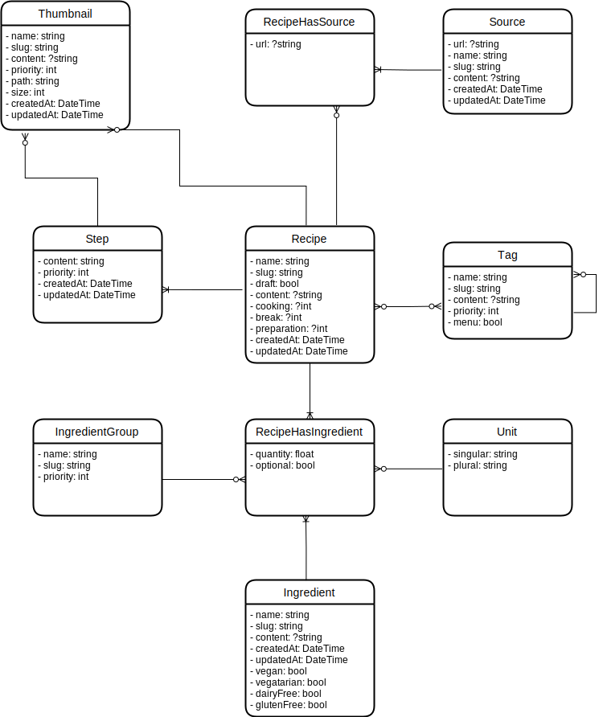

# Recipe project - API

This project, developed in Symfony 6.3 and using API Platform, is an API allowing you to manage the storage and consultation of recipes and related data.

## Documentation

All documentation elements are stored in [the docs/ folder](./docs). However, you will find useful everyday items below.

### The [entity schema](./docs/mcd.drawio.svg)

